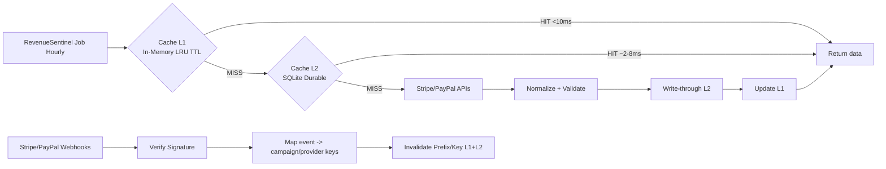

# RevenueSentinel – Système de Cache Intelligent (L1 + L2)

## 1) Architecture (Mermaid)



### ASCII quick view

```text
Caller -> L1(memory) -> L2(SQLite) -> Provider API
           | hit fast      | warm hit       | miss only
Webhook -------------------------------> invalidate keys
```

## 2) Code Python (classe `RevenueCache`)

Implémentation prête à intégrer dans `src/revenue_sentinel.py`:
- L1: `OrderedDict` (LRU + TTL)
- L2: SQLite (`cache_entries`)
- `get_or_set` avec fallback stale-if-error
- invalidation ciblée (`invalidate`, `invalidate_prefix`)
- métriques (`hit_ratio`, `provider_calls`, etc.)

Voir le fichier code: `src/revenue_sentinel.py`.

## 3) Stratégie webhook (Stripe/PayPal -> invalidation)

1. Vérifier les signatures webhook (obligatoire).
2. Mapper l’événement aux clés cache:
   - `provider` (stripe/paypal)
   - `campaign_id` (metadata)
   - `period` (ex: `1h`, `24h`)
3. Invalider granularité fine:
   - clé unique si possible
   - sinon `invalidate_prefix(f"{provider}:{campaign_id}:")`
4. Requête suivante => refresh automatique (cache miss contrôlé).

### Exemple pseudo-code webhook

```python
# event = parsed webhook payload
provider = "stripe"
campaign_id = event["data"]["object"]["metadata"]["campaign_id"]
cache.invalidate_prefix(f"{provider}:{campaign_id}:")
```

## 4) Configuration recommandée

- `ttl_seconds`: `3600` (job horaire)
- `l1_max_items`: `1000` (ajuster selon RAM)
- `sqlite_path`: `./data/revenue_cache.sqlite3`
- `stale_if_error_seconds`: `21600` (6h)

### Justification objectif 80%

- Avec requêtes répétitives par campagne/période, L1 + L2 évitent les appels redondants.
- Webhook invalidation garde les données fraîches sans polling agressif.
- Cible réaliste:
  - `hit_ratio >= 0.80`
  - `provider_calls / total_reads <= 0.20`

## 5) Monitoring / métriques

Exporter `cache.metrics()` toutes les 60s:

- `l1_hits`, `l2_hits`, `misses`
- `provider_calls`
- `hit_ratio`
- `invalidations`
- `stale_served` (résilience)
- `errors`
- `l1_size`

### SLOs cibles

- Cache hit latency: `<10ms` (L1)
- API call reduction: `>=80%`
- Reliability: `100%` service continuity (stale-if-error + L2 durable)

## Intégration rapide dans `src/revenue_sentinel.py`

```python
cache = RevenueCache(CacheConfig())
key = make_cache_key("stripe", campaign_id="cmp_42", period="1h")

payload = cache.get_or_set(
    key,
    provider_fn=lambda: stripe_client.fetch_campaign_revenue("cmp_42", "1h"),
)
```
